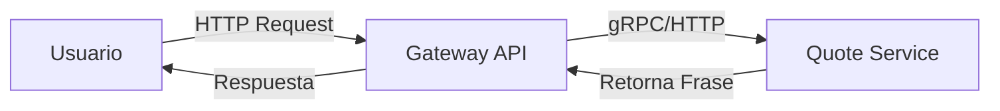

# Introducción a OpenTelemetry con un Caso Práctico

¡Bienvenido! En esta serie de tutoriales, exploraremos el mundo de la observabilidad utilizando OpenTelemetry.

Para ilustrar los conceptos, utilizaremos una arquitectura de microservicios sencilla compuesta por dos componentes principales:
1. **Gateway API**: Actúa como punto de entrada.
2. **Quote Service**: Un servicio que almacena y expone frases célebres.

El `Gateway API` se conecta al `Quote Service` para recuperar la información y entregarla al usuario. Ambos servicios están desarrollados en Java y se ejecutarán dentro de un clúster de Kubernetes.

# Entorno: Cluster de Kubernetes

Para este laboratorio hemos utilizado **k3s**, una distribución ligera de Kubernetes certificada, ideal para desarrollo y pruebas.

## Exposición de Servicios

Para mantener la simplicidad del laboratorio, los servicios se exponen utilizando `NodePort`. Si bien en un entorno productivo lo ideal sería implementar un Ingress Controller o un Kubernetes Gateway, `NodePort` nos permite acceder rápidamente a nuestras aplicaciones desde fuera del clúster sin configuraciones adicionales complejas.

# ¿Qué aprenderemos?

Nuestro objetivo principal es instrumentar el servicio de frases (`Quote Service`) e integrar progresivamente los tres pilares de la observabilidad:

1.  **Trazas (Traces)**: Entenderemos el recorrido de una petición. Inicialmente usaremos **Jaeger**.
2.  **Métricas (Metrics)**: Analizaremos el comportamiento del sistema. Usaremos **Prometheus**.
3.  **Logs**: Centralizaremos los registros. Usaremos **Loki**.

## Estrategia de Instrumentación

Utilizaremos la **autoinstrumentación** para aplicaciones Java. Esto nos permite obtener datos de telemetría sin necesidad de modificar el código fuente de la aplicación, aprovechando la magia del Agente de OpenTelemetry.

Al finalizar, exploraremos cómo cambiar los *exporters* para enviar nuestra data a sistemas externos, demostrando la flexibilidad de OpenTelemetry.
