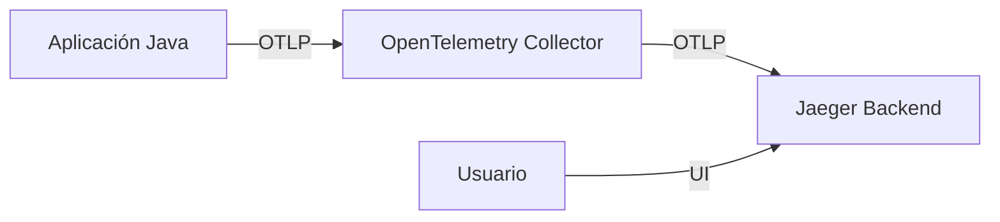

# Implementación de Trazas (Traces) con OpenTelemetry y Jaeger

En esta sección configuraremos todo lo necesario para instrumentar nuestra aplicación y visualizar las trazas distribuidas utilizando **Jaeger**.

El flujo que implementaremos será el siguiente:



## 1. Requisitos Previos

Antes de instalar el Operador de OpenTelemetry, necesitamos **Cert Manager**. El operador lo utiliza para gestionar los certificados de los webhooks de admisión.

```bash
kubectl apply -f https://github.com/cert-manager/cert-manager/releases/download/v1.13.2/cert-manager.yaml
```

> **Nota**: Puedes consultar la documentación oficial de instalación [aquí](https://cert-manager.io/docs/installation/).

## 2. Instalación del Operador de OpenTelemetry

El operador nos facilitará enormemente la gestión de componentes de OpenTelemetry en Kubernetes, como la inyección automática de agentes.

```bash
kubectl apply -f https://github.com/open-telemetry/opentelemetry-operator/releases/latest/download/opentelemetry-operator.yaml
```

> **Documentación**: [OpenTelemetry Operator](https://opentelemetry.io/docs/platforms/kubernetes/operator/).

## 3. Instalación de Jaeger

Utilizaremos Jaeger como backend para almacenar y visualizar nuestras trazas. Para este laboratorio, usaremos una instalación simple "all-in-one".

Puedes encontrar los archivos de despliegue en la carpeta `jaeger/`:
- `jaeger/deploy.yaml`: Contiene el Deployment y Service.

Para instalarlo (asumiendo que estás en la raíz de `otel-demo/01-trazas`):

```bash
kubectl create ns jaeger
kubectl apply -f jaeger/deploy.yaml
```

Una vez desplegado, podrás acceder a la interfaz de Jaeger mediante NodePort en: `http://<TU_IP_NODO>:30686/search`

## 4. Configuración del OpenTelemetry Collector

El Collector es un componente intermedio que recibe, procesa y exporta telemetría. Configuraremos uno en modo `DaemonSet` para recibir datos de nuestras aplicaciones y enviarlos a Jaeger.

El archivo de configuración se encuentra en `collector-config.yaml`. Aquí un extracto de lo que hace:

```yaml
    receivers:
      otlp:
        protocols:
          grpc:
            endpoint: 0.0.0.0:4317
          http:
            endpoint: 0.0.0.0:4318

    exporters:
      debug:
        verbosity: detailed
      otlp/jaeger:
        endpoint: jaeger.jaeger.svc.cluster.local:4317
        tls:
          insecure: true

    service:
      pipelines:
        traces:
          receivers: [otlp]
          exporters: [debug, otlp/jaeger]
```

Para aplicarlo:

```bash
kubectl apply -f collector-config.yaml
```

Esto creará el namespace `collector` y desplegará el recurso `OpenTelemetryCollector`.

## 5. Autoinstrumentación

Para instrumentar nuestras aplicaciones Java sin tocar el código, definiremos un recurso `Instrumentation`. Esto le dice al Operador cómo configurar el agente de Java.

El archivo se encuentra en `instrumentation.yaml`:

```yaml
apiVersion: opentelemetry.io/v1alpha1
kind: Instrumentation
metadata:
  name: quotes-instrumentation
  namespace: collector
spec:
  exporter:
    endpoint: "http://quotes-collector.collector.svc.cluster.local:4317"
  propagators:
    - tracecontext
    - baggage
  sampler:
    type: parentbased_traceidratio
    argument: "1"
  env:
    - name: OTEL_JAVA_LOG_LEVEL
      value: "DEBUG"
    - name: OTEL_JAVA_DISABLE_LOGGING
      value: "false"
```

Aplicamos la configuración:

```bash
kubectl apply -f instrumentation.yaml
```

### Inyectando la instrumentación

Finalmente, debemos indicar qué namespaces o pods deben ser instrumentados. Lo haremos mediante anotaciones en los namespaces de nuestras aplicaciones (`gateway-ns` y `quotes-ns`).

```bash
# Anotar el namespace del gateway
kubectl annotate namespace gateway-ns instrumentation.opentelemetry.io/inject-java=collector/quotes-instrumentation

# Anotar el namespace del servicio de quotes
kubectl annotate namespace quotes-ns instrumentation.opentelemetry.io/inject-java=collector/quotes-instrumentation
```

> **Importante**: Si los pods ya estaban corriendo, deberás reiniciarlos para que la instrumentación surta efecto.

## 6. Verificando el Resultado

1.  Genera tráfico a tu aplicación (haz algunas peticiones al Gateway).
2.  Abre Jaeger en tu navegador: `http://<TU_IP_NODO>:30686/search`.
3.  Deberías ver las trazas completas viajando desde el `gateway-api` hacia el `quote-services`.

### ¿Qué hemos logrado?

Hemos configurado un pipeline completo de observabilidad para trazas:
1.  **Autoinstrumentación**: El agente captura datos de la JVM.
2.  **Collector**: Recibe los datos, los procesa (y podríamos filtrarlos o transformarlos).
3.  **Jaeger**: Almacena y visualiza las trazas para que podamos depurar problemas de rendimiento o errores.
