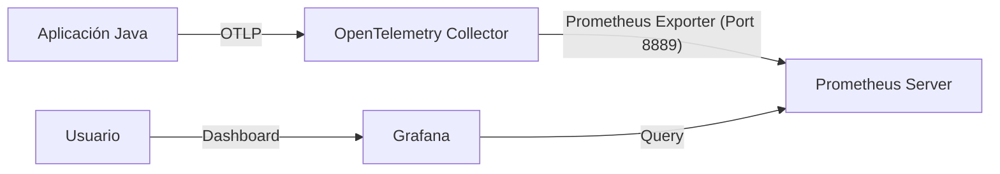

# Implementación de Métricas con Prometheus y Grafana

En esta sección ampliaremos nuestra configuración de observabilidad para incluir métricas. En lugar de enviarlas directamente a un backend, el OpenTelemetry Collector las expondrá para que **Prometheus** las recolecte (scrape). Luego, utilizaremos **Grafana** para visualizarlas.

El flujo de datos será el siguiente:



## 1. Instalación de Prometheus y Grafana

Para este laboratorio, utilizaremos Helm para instalar Prometheus y Grafana. Los archivos de configuración necesarios (`values.yaml` personalizados) y las plantillas generadas (`deploy.yaml`) se encuentran en las carpetas `prometheus/` y `grafana/` respectivamente.

### Instalando Prometheus

Los archivos se encuentran en la carpeta `prometheus/`.

1.  Agregar el repositorio de Helm (opcional si ya tienes el deploy.yaml):
    ```bash
    helm repo add prometheus-community https://prometheus-community.github.io/helm-charts
    helm repo update
    ```

2.  Generar la plantilla (si quisieras hacerlo desde cero):
    ```bash
    helm template prometheus prometheus-community/prometheus --namespace prometheus --values prometheus/values.yaml > prometheus/deploy.yaml
    ```
    *Nota: El archivo `deploy.yaml` ya ha sido editado para desactivar componentes no necesarios (como AlertManager) y ajustar retenciones.*

3.  Instalar utilizando el manifiesto incluido:
    ```bash
    kubectl create ns prometheus
    kubectl apply -f prometheus/deploy.yaml
    ```

### Instalando Grafana

Los archivos se encuentran en la carpeta `grafana/`.

1.  Agregar el repositorio de Helm:
    ```bash
    helm repo add grafana https://grafana.github.io/helm-charts
    helm repo update
    ```

2.  Generar la plantilla:
    ```bash
    helm template grafana grafana/grafana --namespace grafana --values grafana/values.yaml > grafana/deploy.yaml
    ```
    *Nota: El archivo `deploy.yaml` se editó posteriormente para habilitar NodePort en el puerto 30300.*

3.  Instalar utilizando el manifiesto incluido:
    ```bash
    kubectl create ns grafana
    kubectl apply -f grafana/deploy.yaml
    ```

4.  Obtener la contraseña del usuario `admin`:
    ```bash
    kubectl get secret -n grafana grafana -o yaml
    ```
    *(Busca el campo `admin-password`, decodifícalo de base64 y úsalo para loguearte).*

5.  Acceder a Grafana: `http://<TU_IP_NODO>:30300`

### Conectando Grafana con Prometheus

Una vez dentro de Grafana:
1.  Ve a **Connections** -> **Data Sources** -> **Add new data source**.
2.  Selecciona **Prometheus**.
3.  En la URL de conexión, ingresa: `http://prometheus-server.prometheus.svc.cluster.local`
4.  Haz clic en **Save & test**.

## 2. Configurando OpenTelemetry para Métricas

Ahora debemos actualizar nuestro Collector para que procese métricas.

El archivo `collector-config.yaml` en este directorio ya incluye los cambios necesarios respecto a la versión de trazas:

1.  **Prometheus Exporter**: Se configura para escuchar en el puerto `8889` y convertir los recursos de OTLP a etiquetas de Prometheus.
    ```yaml
          prometheus:
            endpoint: "0.0.0.0:8889"
            resource_to_telemetry_conversion:
              enabled: true
    ```

2.  **Metrics Pipeline**: Se activa el pipeline de métricas.
    ```yaml
            metrics:
              receivers: [otlp]
              exporters: [debug, prometheus]
    ```

Aplica la nueva configuración del Collector:

```bash
kubectl apply -f collector-config.yaml
```

## 3. Configuración de la Autoinstrumentación

Debemos actualizar el recurso `Instrumentation` para indicar explícitamente cómo exportar las métricas. Aunque el archivo `instrumentation.yaml` no ha cambiado de nombre, su contenido ha sido actualizado (o deberías actualizarlo) para incluir variables de entorno clave.

En `instrumentation.yaml` agregamos:

```yaml
    - name: OTEL_METRICS_EXPORTER
      value: "otlp"
    - name: OTEL_EXPORTER_OTLP_METRICS_TEMPORALITY_PREFERENCE
      value: "cumulative"
```

Esto asegura que las métricas se envíen por OTLP al Collector y usen acumulación "cumulative", que es lo que espera Prometheus.

Aplica el cambio:

```bash
kubectl apply -f instrumentation.yaml
```

> **Nota**: Recuerda reiniciar los pods de tu aplicación (`gateway-api`, `quote-services`) para que tomen la nueva configuración de instrumentación.

## 4. Configurando el Job en Prometheus

En este punto, el Collector está exponiendo métricas en el puerto `8889`, pero Prometheus no sabe que debe ir a buscarlas allí. Necesitamos configurar un "Scrape Job".

Editaremos el ConfigMap de Prometheus:

```bash
kubectl edit cm -n prometheus prometheus-server
```

Busca la sección `scrape_configs` dentro de `prometheus.yml` y agrega el siguiente job. Este job descubre dinámicamente los pods del collector y hace el scrape en el puerto 8889.

```yaml
      - job_name: 'otel-collector-app-metrics'
        scrape_interval: 2m
        kubernetes_sd_configs:
          - role: pod
        relabel_configs:
        - source_labels: [__meta_kubernetes_namespace]
          action: keep
          regex: collector
        - source_labels: [__meta_kubernetes_pod_label_app_kubernetes_io_component]
          action: keep
          regex: opentelemetry-collector
        - source_labels: [__address__]
          action: replace
          regex: ([^:]+)(?::\d+)?
          replacement: $1:8889
          target_label: __address__
        - source_labels: [__meta_kubernetes_pod_name]
          action: replace
          target_label: kubernetes_pod_name
        metric_relabel_configs:
        - source_labels: [__name__]
          regex: (.*)
          target_label: __name__
          replacement: quote_services_${1}
```

Guarda y cierra. Prometheus recargará la configuración automáticamente (o tras unos instantes).

## 5. Visualización

1.  Ve a Grafana.
2.  En la sección de **Explore**, selecciona tu data source de Prometheus.
3.  Busca métricas que comiencen con `quote_services_` (gracias al `metric_relabel_configs` que configuramos).
4.  ¡Deberías ver métricas de la JVM, peticiones HTTP, y más!

### Resumen

Hemos logrado:
1.  Recolectar métricas de aplicaciones Java automáticamente.
2.  Enviarlas al OpenTelemetry Collector.
3.  Exponerlas en formato Prometheus.
4.  Configurar Prometheus para recolectarlas y Grafana para visualizarlas.
